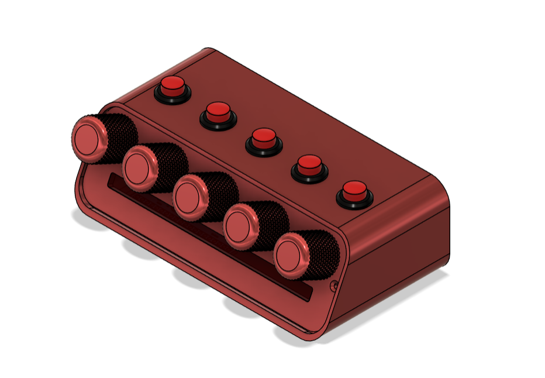
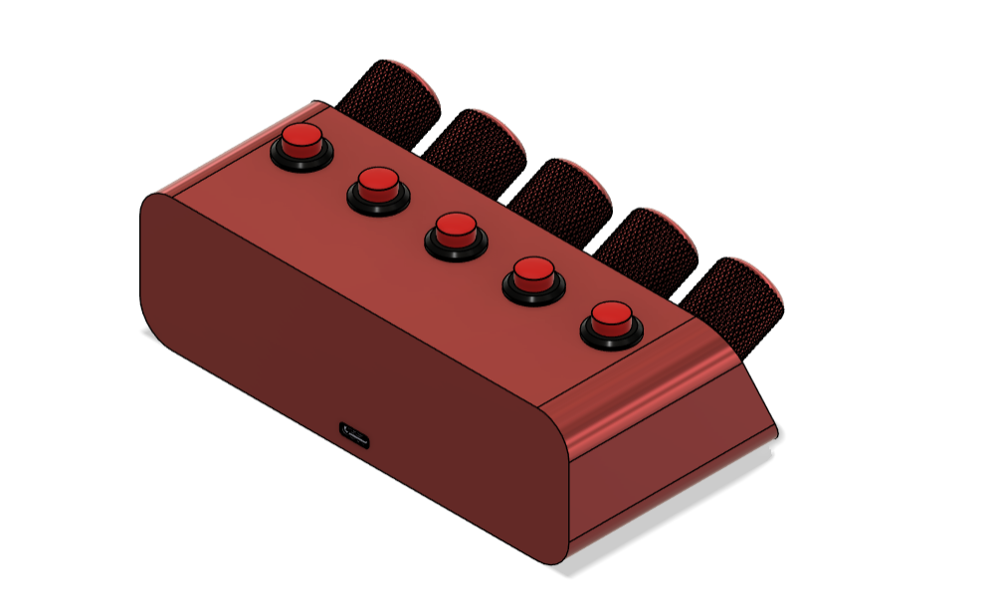

# Deej_Volume_Control_Custom
Documentation Product Volume Control Using Software Deej

## Spesification
- Microcontroller STM32F103
- Bootloader STM32duino
- 5 Potensio 
- 5 Button 
- Case 3D Print
- USB type C
- Compatible with Deej

## Preview Hardware

    
    

## Usage 
You can read original manual user for [deej repository](https://github.com/omriharel/deej), or you can see [this video](https://www.youtube.com/watch?v=9WqwH4tebzI) on minute 16:00